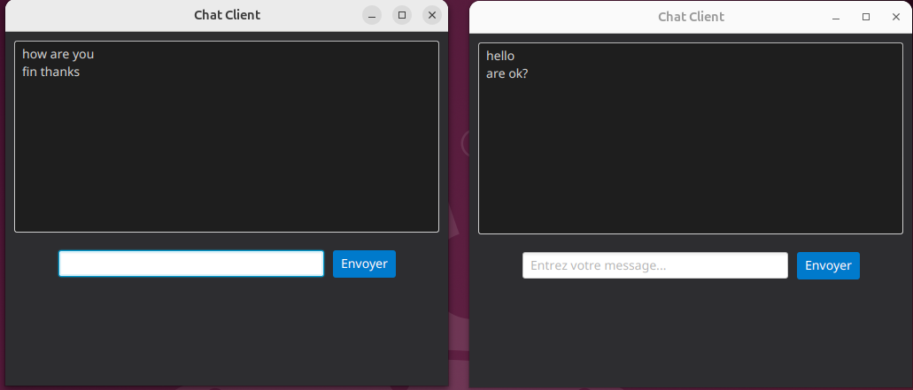

## JavaFX Chat Application with Sockets and Threads

# Description
This project is a simple multi-client chat application developed in Java using JavaFX for the graphical user interface, TCP sockets for network communication, and threads to handle concurrent client connections on the server side.

The application demonstrates the fundamentals of socket programming, multithreading, and GUI development in Java by allowing multiple clients to connect to a server and exchange messages in real-time.

# Features
- Server:
  - Listens for client connections on a specified port.
  - Creates a dedicated thread for each client to handle incoming messages.
  - Broadcasts messages received from any client to all other connected clients.

- Client (JavaFX Application):
  - Connects to the chat server via TCP sockets.
  - Sends messages to the server.
  - Receives and displays messages from other clients in real-time.
  - Provides a simple and user-friendly graphical interface for chatting.

# How It Works
1. **Server**:
   - The server listens for incoming client connections on a specified port.
   - When a client connects, the server creates a new thread to handle that client.
   - Each thread reads messages from the client and broadcasts them to all other connected clients.
2. **Client**:
   - The client connects to the server using a TCP socket.
   - It has a text input field for sending messages and a display area for received messages.
   - When the user sends a message, it is sent to the server, which then broadcasts it to all clients.

# Technologies Used
- Java
- JavaFX
- TCP Sockets
- Multithreading
- Maven (for dependency management)

